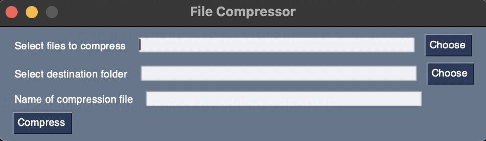

# File Compressor App

 

## <u>Table of Contents</u>

1. [Description](#Description)
2. [Installation](#Installation)
3. [Usage](#Usage)
4. [Contributing](#Contributing)
5. [Authors](#Authors)
6. [License](#License)

## Description

The File Compressor application is a program that can select multiple files from you local machine, and then select a
destination folder. It also allows the user to name the compression file that the program will create. Once the Compress
button is clicked and the program is executed, the files selected will be compressed into an archive (.zip) file in the
destination folder chosen. This application is currently only usable on macOS operating systems.

### Dependencies

This application was made using Python and a number of third party and standard modules. This application uses
PySimpleGUI to create the visual user interface. It also uses the zipfile and pathlib standard python module to execute
the compression functionality.

## Installation

To install this application to your Mac, simply clone or download the repository files on to your local machine. This
will create a folder which contains the application file.

## Usage

There are two primary ways to use this application. The easiest way is to run the standalone executable application
file. This will be an application file found in the project directory called File Compression App. This will open the
user
interface for this application.

The other way to run this application on your local machine is to run it via the command line. This requires Python3 to
be installed on your local machine. Once you clone, or download, the project repository onto your local machine.
Navigate to the root directory of the project via the command line and run the following command:

```commandline
python3 main.py
```

This will run the command via your command line and will allow you to use the application just as if you are executing
the standalone application.

The following image shows the application user interface:

 

### Navigating The Application

To use the application, first click the choose button beside the Select files to compress input. This will allow you to
select multiple files that you wish to compress. Once selected, the paths to these files will be displayed on the input
field. Next, click the Choose button next to the Select destination folder label/input and select the folder where you
would like the compression to be placed in. Once these paths are displayed on the inputs, name your new compression file
in the last input field. Then simply click Compress and your archive file will be created in that destination folder.
Happy Compressing!

## Contributing

We are always looking to improve your application and code, so if you wish to contribute, please create a repository and
push all changes you make to it. Then email me at charanvir123@gmail.com, and I will try to get back to you after I have
reviewed the code.

## Authors

To view more projects visit my [GitHub](https://github.com/Charanvir) account.

Direct any additional questions you have regarding this application to charanvir123@gmail.com

# License

The following application is covered under the MIT License.